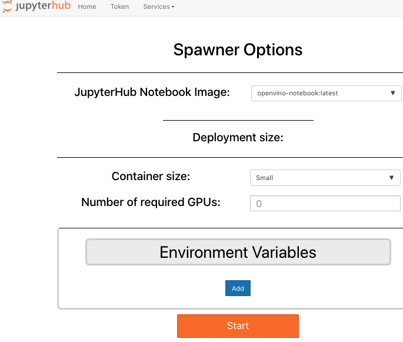

## About this Operator
This Operator for OpenShift manages OpenVINO tools in the cluster.

It allows easy deployment and management of OVMS service in the OpenShift cluster by just creating `ModelServer` resource.

Beside that, the operator can enable integration between [Red Hat Open Data Science operator](https://www.redhat.com/en/technologies/cloud-computing/openshift/openshift-data-science)
and OpenVINO jupyter notebook image. 


## Operator deployment

In the web console navigate to OperatorHub menu. Search for "OpenVINO" and select "OpenVINO Operator". Click `Install` button.

## Deploying OpenVINO Model Server via the Operator

### OpenShift console

While you deploy OVMS Operator in [OpenShift](https://www.openshift.com/), you can manage the instances of OVMS using
the [web console](https://docs.openshift.com/container-platform/4.6/web_console/web-console.html).

Navigate to the menu `Installed Operators` and click the link `Create ModelServer` or `Create Notebook`.
You will be presented with the template of the OVMS deployment configuration:


Adjust the parameters according to your needs. Use helm chart documentation as a [reference about all the parameters](../../deploy/#helm-options-references).


### OC CLI

Alternatively, after installing the operator, deploy and manage OVMS deployments by creating `ModelServer` resources.

It can be done by editing the [sample resource](config/samples/intel_v1alpha1_ovms.yaml) and running a command:

```bash
oc apply -f config/samples/intel_v1alpha1_ovms.yaml
```

The parameters are identical to [Helm chart](../../deploy/#helm-options-references).

<b>Note</b>: Some deployment configurations have prerequisites like creating relevant resources in Kubernetes. For example a secret with credentials,
persistent volume claim or configmap with OVMS configuration file.

## Using the OVMS in the cluster

The operator deploys an OVMS instance as a Kubernetes service with a predefined number of replicas.
The `Service` name is matching the `ModelServer` resource. It will also get `-ovms` suffix unless `ovms` phrase is included 
in the name.

```bash
oc get pods
NAME                           READY   STATUS    RESTARTS   AGE
ovms-sample-586f6f76df-dpps4   1/1     Running   0          8h

oc get services
NAME          TYPE        CLUSTER-IP       EXTERNAL-IP   PORT(S)             AGE
ovms-sample   ClusterIP   172.25.199.210   <none>        8080/TCP,8081/TCP   8h
```

OpenShift service with OVMS is exposing the gRPC and REST endpoints for running the inference requests.
Here are the options for accessing the endpoints:
- deploy the client inside the Kubernetes `pod` in the cluster. The client in the cluster can access the endpoint via the service name or the service cluster ip
- configure the service type as the `NodePort` - it will expose the service on the Kubernetes `node` external IP address
- in the managed Kubernetes cloud deployment use service type as `LoadBalanced` - it will expose the service as external IP address
- configure OpenShift [`route` resource](https://docs.openshift.com/container-platform/4.6/networking/routes/route-configuration.html) 
  or [`ingress` resource](https://kubernetes.io/docs/concepts/services-networking/ingress/) in opensource Kubernetes linked with OVMS service.
  In OpenShift, this operation could be done from the web console.
  
You can use any of the [exemplary clients](../../example_client) to connect to OVMS. 
Below is the output of the [jpeg_classification.py](../../example_client/jpeg_classification.py) client connecting to the OVMS serving ResNet model.
The command below takes --grpc_address set to the service name so it will work from the cluster pod.
In case the client is external to the cluster, replace it with the external DNS name or external IP  and adjust the --grpc_port parameter.

```bash
$ python jpeg_classification.py --grpc_port 8080 --grpc_address ovms-sample --input_name 0 --output_name 1463
Start processing:
	Model name: resnet
	Images list file: input_images.txt
images/airliner.jpeg (1, 3, 224, 224) ; data range: 0.0 : 255.0
Processing time: 25.56 ms; speed 39.13 fps
Detected: 404  Should be: 404
images/arctic-fox.jpeg (1, 3, 224, 224) ; data range: 0.0 : 255.0
Processing time: 20.95 ms; speed 47.72 fps
Detected: 279  Should be: 279
images/bee.jpeg (1, 3, 224, 224) ; data range: 0.0 : 255.0
Processing time: 21.90 ms; speed 45.67 fps
Detected: 309  Should be: 309
images/golden_retriever.jpeg (1, 3, 224, 224) ; data range: 0.0 : 255.0
Processing time: 21.84 ms; speed 45.78 fps
Detected: 207  Should be: 207
images/gorilla.jpeg (1, 3, 224, 224) ; data range: 0.0 : 255.0
Processing time: 20.26 ms; speed 49.36 fps
Detected: 366  Should be: 366
images/magnetic_compass.jpeg (1, 3, 224, 224) ; data range: 0.0 : 247.0
Processing time: 20.68 ms; speed 48.36 fps
Detected: 635  Should be: 635
images/peacock.jpeg (1, 3, 224, 224) ; data range: 0.0 : 255.0
Processing time: 21.57 ms; speed 46.37 fps
Detected: 84  Should be: 84
images/pelican.jpeg (1, 3, 224, 224) ; data range: 0.0 : 255.0
Processing time: 20.53 ms; speed 48.71 fps
Detected: 144  Should be: 144
images/snail.jpeg (1, 3, 224, 224) ; data range: 0.0 : 248.0
Processing time: 22.34 ms; speed 44.75 fps
Detected: 113  Should be: 113
images/zebra.jpeg (1, 3, 224, 224) ; data range: 0.0 : 255.0
Processing time: 21.27 ms; speed 47.00 fps
Detected: 340  Should be: 340
Overall accuracy= 100.0 %
Average latency= 21.1 ms
```

## OpenVINO Notebook integration with Redhat Open Data Science services.

The `Notebook` resource integrates JupyterHub from OpenShift Data Science or Open Data Hub with a container image that includes developer
tools from the OpenVINO toolkit and a set of Jupyter notebook tutorials. It enables selecting a defined image `openvino-notebook` from
the Jupyter Spawner drop-down menu. The image is maintained Intel.

Create the `Notebook` resource in the same project with JupyterHub and RedHat OpenShift Data Science operator.
It build the image locally based on Dockerfile from https://github.com/openvinotoolkit/openvino_notebooks

